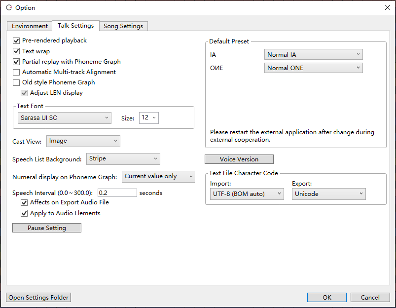
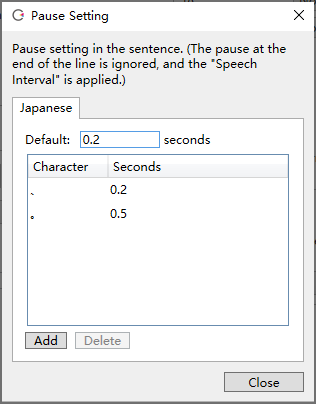
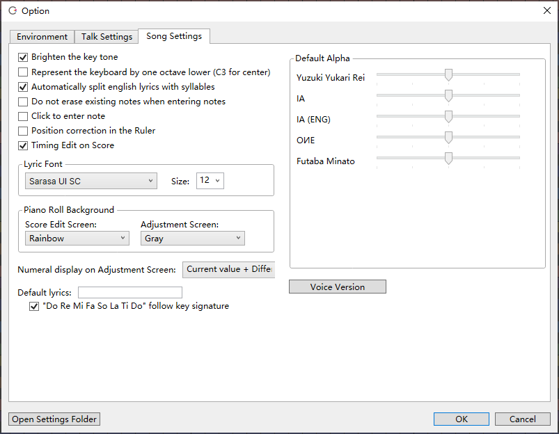
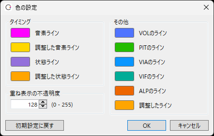

Original article: [CeVIO AI ユーザーズガイド ┃ オプション](https://cevio.jp/guide/cevio_ai/option/)

---

!!! tip
    If you don't understand what an option does, try hovering the mouse over that option for a while.

"Options" in the "Tools" menu can modify various settings.

## Environment

### Image

#### Show image on the right side

When this option is on, the character image will be displayed on the upper right of the main screen.

##### View Large

When this option is on, the character image will expand to the top and bottom of the main screen.

##### Linked to the cast of track

When this option is on, the character image will switch with the track or the line selected.

#### Right Side Image

Set the image to be displayed on the right side of the screen. Click on the image to select an image from the list to display. You can also drag and drop your own image here to register them as a user image and select them.

\* When "Linked to the cast of track" is turned on, "Right Side Image" will show the picture that is displayed when no track is selected.

#### Show cast image of track

Select whether or not to show the image of character in the track header.

#### Image Settings

Modify the display image of each character. This can be replaced by a user image.

[Display user image](characterimage.md)

\* In this example, the image of the the character "OИE"'s Talk voice has been replaced with the user image of Suzuki Tsudumi (すずきつづみ).

### Display Order Setting

Change the order of the cast list displayed when adding tracks or changing casts.

\* If you change the order by drag & drop, it will become "Custom order".

### Default Track Configuration

Set the track name, type and cast for the new project.

The track selected in the 'Selection' column will start with the selected state.

The character at the top of the cast list will be the default cast when the track is created.

### Interface Language

Switch language that displayed in the user interface.

### Audio Device

You can select audio devices other than the default audio device here.

### Export WAV Format

Specify the sampling rate and bit depth of the exported WAV file.

\* The higher the bit depth, the better the sound quality. The sound quality at a sampling rate of 96kHz is no different from 48kHz.

\* Currently, the format of WAV file exported in "Audio Mixdown" is fixed at 48kHz 16bit.

### Audio Folder

Set a folder for storing temporary files generated when freezing tracks or loading external audio files.

\* Temporary files are not automatically deleted. To reduce the amount of space used on the hard drive, using the 'Clear' button clear them.

\* Please DO NOT save user data in this folder and its subdirectories. There is a risk of data loss.

### Mouse Wheel

Change the default scroll direction (vertical / horizontal) for timeline, etc.

### Number of Undo Levels

Max to 100000.

The more undo levels, the more memory it consumes.

### Open the previous project at startup

At startup, open the project edited when the application is last closed and restore to its previous edited state.

### Show Splash Screen

When this option is on, the splash screen will not be displayed at startup, making it easier to operate other apps during startup.

### Show Update Information

You can turn it off when you want to fix the version of this software by external cooperation, when you want to stay at a specify version, etc.

### Stop at the start position

When the stop button (or ++num0++) is continuously pressed during stop, select whether to let the position cursor go back to the beginning of track or stay at the playback position.

### Do not show completion window

Do not show the completion dialog box after WAV export or text import.

### Old style parameter

Parameters such as volume, speed, and emotion are displayed from 0 to 100 (CeVIO Creative Studio style).

### Mark all notifications as read

Mark all notifications displayed after startup as read. Useful when you move to another PC or just don't want to see ads.

## Talk Settings

### Pre-rendered playback

Synthesize speech before playback starts to avoid skipping or pausing during playback.

If there are a lot of lines, it will take a while for the first playback, but after that, only the edited lines will be synthesized to speed up the playback.

If this option is turned off, real-time speech synthesis will be used.

### Text wrap

In Speech List, wrap the long sentences at the right edge to display the whole sentence.

### Partial replay with Phoneme Graph

Automatic play the section of the Phoneme Graph from the previous pause before the adjustment point (e.g. punctuation) to the next pause after the adjustment point.

### Automatic Multi-track Alignment

When auto-align is enabled from "Automatic Line Alignment" in the "Talk" menu or the right-click menu, lines from other tracks will be automatically moved backwards and forwards to avoid overlap.

When "Automatic Audio Alignment" is turned on, audio elements will also be automatically aligned so that they will not overlap each other.

If this option and "Align Track Elements" in the "Track" menu are both turned on, the contents of other tracks will be aligned as well. If you don't want to move the lines in the other track (overlap them), turn it off.

### Old style Phoneme Graph

The horizontal axis is set at regular intervals, the vertical axis is for LEN adjustment, and the LEN can be up to 1 second.

\* Same as CeVIO Creative Studio version 5.2.

#### Adjust LEN display

The smaller the LEN value, the longer it is displayed in old style Phoneme Graph. The vertical axis is set at regular intervals when off.

### Text Font

Specify the font and size in Speech List.

### Cast View

Choose one of Image, Name or Image + Name as the way to display the character on the left side of the Speech List.

### Speech List Background

Choose from 5 background theme for the Speech List.

- Stripe
- Light Blue
- Dark Blue
- White
- Black

### Numeral display on Phoneme Graph

Select the value displayed when the cursor is hovering over the Phoneme Graph.

### Speech Interval

Specify the interval between lines when entering or aligning them.

#### Affects on Export Audio File

Assign the same length of silence as Speech Interval to the end of line when export lines to audio files.

#### Apply to Audio Elements

Audio elements will automatically maintain the interval when you apply "Align Track Element" or turn on "Automatic Audio Alignment" and edit. If it is further combined with "Automatic Multi-track Alignment", it will be easier to create dialogues with other text-to-speech software.

### Pause Setting

Set individual pause lengths for punctuation marks and symbols.

\* You can also set the shortest full-width space to 0.025 seconds and use it to break up accent phrases by entering lines like "みなさん　こんにちは".

\* If you want the length of silence at the end of the WAV to be zero, turn off "Affects on Export Audio File".

### Default Preset

Specify the preset to be used when creating a new track, changing a cast or calling during external cooperation.

Please restart the external application after change during external cooperation.

!!! tip "Default presets for external cooperation"
    In SAPI5, "speed" is determined by the setting of the linking party, "volume" and "pitch" are jointly determined by the setting of the linking party and this application, and other settings are determined by this application. If the sound is low when connecting to SAPI5, try setting the preset volume to +8.00 / 100.

    In COM components / .NET assemblies, conditions and emotions are the default.

    \* If all parameters are controlled by the linked application, these settings will not be used.

### Text File Character Code

Specify the encoding to be used when reading files and exporting files.

Please modify the encoding as required to match the external software used to import or export the text files.

## Song Settings

### Brighten the key tone

Highlight the tonic of the current key signature on the score editing page.

### Represent the keyboard by one octave lower (C3 for center)

Represents the sound of 440Hz as A3 (was A4) on the Piano Roll keyboard.

### Do not erase existing notes when entering notes

When entering notes, notes already entered will not be deleted, even if they would cause an overlap.

### Click to enter note

Enable DAW-like operation to input notes directly with a single click, no dragging required.

When this option is on, you can still specify the length by dragging. When not dragging, the length will be quantized.

### Position correction in the Ruler

Enables DAW-like operation to shift position correction by quantizing towards to the left or the right closer in the Piano Roll Ruler.

### Timing Edit on Score

Simply check and adjust Timing at the bottom of the score editing screen.

\* When hidden, you can still enter phonemes from the "Enter Lyrics with Phoneme" in "Song" menu or from the Note Properties.

### Lyric Font

Specify the font and size of lyrics.

### Piano Roll Background

For the background of the Piano Roll, choose from 6 background theme for the Score Editing Screen.

- Rainbow
- Pastel
- Simple
- Blue
- Gray
- Black

Choose from 2 background theme for the Adjustment Screen.

- Gray
- Black

### Adjustment Screen Color Settings

Freely customize the color of the lines such as TIMING and pitch on the Adjustments Screen.

### Numerical Display

Select the value display when hovering the mouse cursor over a parameter on adjustment screen.

### Default lyrics

Change the default lyrics when entering notes, for example to "ら".

If left blank, "ドレミファソラシ" (Do Re Mi Fa So La Ti) is assigned according to the scale by default.

#### "Do Re Mi Fa So La Ti Do" follow key signature

If "Default Lyrics" is left blank, unchecking it will fix "ドレミ......" to C Major.

### Default Alpha

Specify the alpha value when creating a new track or changing a cast.

!!! info "About setting folder"

    The following configuration files (except option settings, which are generated when using this function) are stored in the folder.

    - TalkDictionary3.dic (user dictionary)
    - PhraseClips.xml (speech clips)
    - Personality.xml (preset)
    - RuntimeSettings.xml (option settings)

    If you want to transfer your settings to another PC, please select File > Export > Settings File to export a file, then import it from File > Import > Settings File on another PC.
