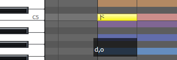
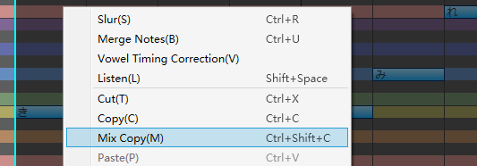
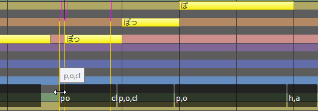

Original article: [CeVIO AI ユーザーズガイド ┃ 音符の入力と編集](https://cevio.jp/guide/cevio_ai/songtrack/song_02/)

---

Notes can be input and edited using the adjustment tool in the "Edit Score" state.

## Input Note

To input a note, select the draw tool from the edit tools.

On the piano roll, move to the right from where you want to place the note (hold down the left mouse button) to determine the length of that note.

Click on the scale and character assigned to this track will sing this key.

\* The very first bar (bar 0) does not allow notes input.

\* When performing a note input, move or paste operation, if a note overlaps with another note on the same track, that note will be automatically shortened. (Optional. You can select "Do not erase existing notes when entering notes" in the options.)

<!-- When a note is entered, the phoneme and vocal time of the lyrics are displayed below it. The timing can be adjusted here. -->

!!! tip "Hint for note input"
    It is not recommended to use the tiny gaps between the notes to express the sokuon (っ, small tsu), or to use the position of the notes to express the timing of the vocalization.

    Including the sokuon in the lyrics and adjusting the timing of the vocalization in the Timing adjustment screen will get a better song.

## Delete Note

Select the eraser tool from the edit tool and click on a note to erase it.

Alternatively, when using a tool other than the eraser tool, select the note and press ++del++ can also delete it.

## Adjust Note Length

Note length can be changed by selecting the selection tool or draw tool from the edit tool and dragging the right or left edge of the note.

## Move Note

Select the selection tool or the draw tool from the edit tool and drag the note to move it.

Hold down the ++shift++ key while dragging to move the note horizontally or vertically.

<!-- When multiple notes are selected at the same time, you can move them together. -->

Alternatively, hold down ++alt++ while dragging to copy the selected note.

Moving note to bar 0 is not allowed.

### Move Note with Parameters

After selecting notes, drag with the mouse or move them with ++up++ or ++down++ keys, and the pitch will automatically follow their change.

Use the [Collectively Selection Tool](../song_05) to specify the range, and then move them, the notes in the selection range will move together with their parameters.

\* Hold down the ++shift++ key while dragging to move the note horizontally or vertically.

!!! tip "Auto Collectively Selection"

    If you move notes which have been adjusted parameters, they will automatically be collectively selected and the parameters will follow, even if you move them with a tool other than the Collectively Selection Tool. At this time, if you hold down the ++alt++ key and move a note vertically, this note will not be collectively selected, and the adjusted pitch will remain in the original place.

    \* You can turn it off from the "Song" menu or the right-click menu "Other Operations".

## Copy and Paste Note

Choose the select tool or the draw tool from the edit tool and click on the note to be copied.

Multiple notes can be selected by holding down the ++rctrl++ or ++shift++ keys and clicking on the notes.

It is also possible to select multiple notes within the dragging range by dragging in the piano roll while using the selection tool.

After selecting the notes, select "Copy" from the context menu.

Then, select "Paste" from the right-click menu to paste the notes at the cursor position.

### Paste Lyrics Only

After copying a note, you can select "Paste Lyrics Only" from the right-click menu of the note you want to paste the lyrics to.

The lyrics will be applied to the note whose relative time matches that of the source note. You can use this feature to create chorus tracks, etc.

You can also edit phoneme symbols by double-clicking on a note with "Enter lyrics by phoneme" on, or from the note properties.

### Copy and Paste Note with Parameters

By using the [Collectively Selection Tool](../song_05) to specify the range and copy, you can also copy the note adjustment value, beat, dynamics marks and other parameters within the range. Afterwards, by specifying the position with the cursor and pasting, you can easily reproduce the original notes and adjustment values.

### Mix Copy

After selecting a range using the Collectively Selection Tool (or the Selection Tool in the adjustment screen), you can copy the parameters, including the default values, by using the "Mix Copy" option in the right-click menu or by using the shortcut key ++ctrl+shift+c++.

With Collectively Selection + Mix Copy, you can easily duplicate some or all of the notes and parameters of a track to another position/track. For example, you can adjust the singing of a song for one cast and then paste it onto another cast to let they sing.

\* Due to the reflected adjustment value, there may be instances where applying parameters to a different cast may result in suboptimal singing quality. Even the same cast may not perform identically in a different location as the original copy source. Therefore, it is recommended to readjust the parameters as necessary to achieve the desired outcome.

## Simple TIMING Display

When notes are entered, the lyrics' phoneme symbols and vocal timing are displayed in black bands at the bottom of the screen, which allow simple timing adjustments, etc.

\* If the screen is narrow, you can hide it by turning off "Timing Edit on Score" in "Song" under ["Option"](../option/index.md).

### Simple TIMING Adjustment

Move the mouse cursor over the black bars with the Draw Tool to see the consonant and vowel timing lines, and drag them left or right to adjust the timing of the utterance.

Normally, it is adjusted in note units, but when "Enter Lyrics with Phoneme" in the "Song" menu is turned on (or the ++ctrl+p++ key is pressed), it is adjusted in phoneme units. You can also switch temporarily by pressing the ++alt++ key.

### Specify phoneme symbols

Double-click on the phoneme symbols displayed on TIMING to edit the phoneme.

<!-- \* You can also edit phoneme symbols by turning on "Enter Lyrics with Phoneme" and then double-clicking on a note, or by using the note properties. -->
