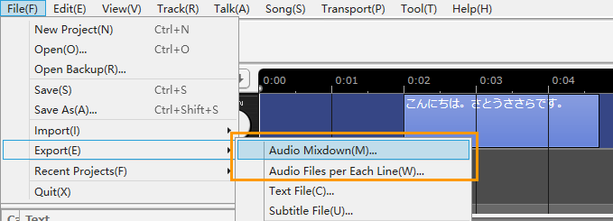

Original article: [CeVIO AI ユーザーズガイド ┃ はじめてのトーク作成](https://cevio.jp/guide/cevio_ai/tutorial_talk/)

---

Whether dialogue or narration, you can use CeVIO to create the suitable sound.

With a single click, you can use emotion presets such as "元気一杯" and "哀しげ"[^1], and adjust the volume and speed in detail.

## 1. Start the application

After starting the application, the tracks will be displayed at the top of the screen.

If there are multiple tracks, click on the track name (or timeline) labeled "Talk 1" to display the talk editing screen at the bottom of the screen.

\* Right-click on the character image on the right and turn on "View Larger" to enlarge the image vertically.

## 2. Input Lines

Select a line in Talk editing screen, then click this line and enter text.

## 3. Select Cast

If there are multiple available casts, you can choose the character who will speak that line in the Cast column.

## 4. Set the emotion

The presets on the right side of the Talk edit screen allow you to set emotions with a single touch.

You can also blend multiple emotions together by using the emotion control (slider on the bar graph).

## 5. Listen

You can listen to the selected line by clicking Listen/Stop button.

## 6. Vocalization Timing of Lines

After entering a line, an element (box) of the line will appear in the timeline.

Drag (left-click and hold) the element to change the timing of its vocalization.

Pressing the play button allows you to listen to the audio with the timing changes applied to all tracks.

## 7. Export the audio file

From the menu, go to File > Export > Audio Mixdown to combine all tracks and export them as a single file in stereo WAV format (48kHz 16bit).

You can also export each line as separate files in mono WAV format using "Audio File per Each Line"(Sample Rate and Bit Depth can be specified in [Option](../option/index.md).).

[^1]: Translator's note: Both of these are Sasara's emotion preset names, "元気" in 100 and "哀しみ" in 100 respectively.
